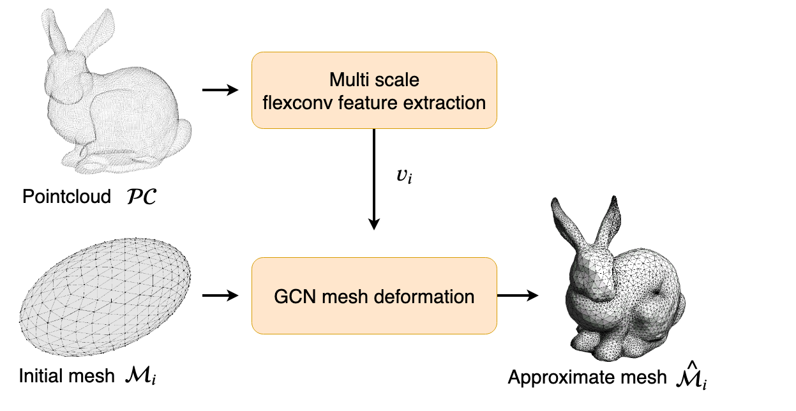
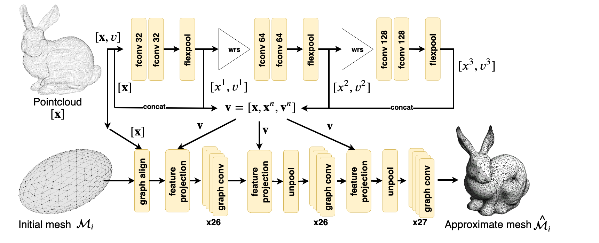

# points2mesh

__points2mesh__ is a novel approach to transform point cloud data into fully-fledged, watertight meshes. Adapted from [pixel2mesh](https://github.com/nywang16/Pixel2Mesh), transforming images to meshes, this deep neural network learns features from unstructured points in three-dimensional space and deforms a basic 3D ellipsoidal shape into the final watertight mesh based on the learned features.
As the first deep learning-based method to transform point cloud data to watertight meshes while producing competitive results with low inference time, it is a pioneer in its subject-matter. Additionally, a supervised as well as an unsupervised variant is present, even working with super low resoultion of only 256 samples per point cloud, up to 8000 samples.

This DNN was developed as part of my [master thesis](https://github.com/Hyde46/points2mesh/blob/master/thesis.pdf).

--------------

__points2mesh__ is trained on a multi-category basis ( 8 categories at the same time ). 
The following shows the input point cloud of 1024 samples of an airplane. Followed by its reconstruction by __points2mesh__ and the underlying ground truth mesh on the right. The resulting reconstruction has 2560 vertices, while the ground truth has more than 100 thousand vertices.

(Input point cloud data on the left from test set, prediction in the middle, ground truth mesh on the right)

--------------

The structure of the deep neural network is defined as follows:

--------------

Three more examples of reconstruction with only 256 samples of the point cloud.

A collection of reconstructed airplanes with 1024 samples of the point cloud, without cherrypicking the best results ;) (Displayed with Show_objects.blend in blender )

