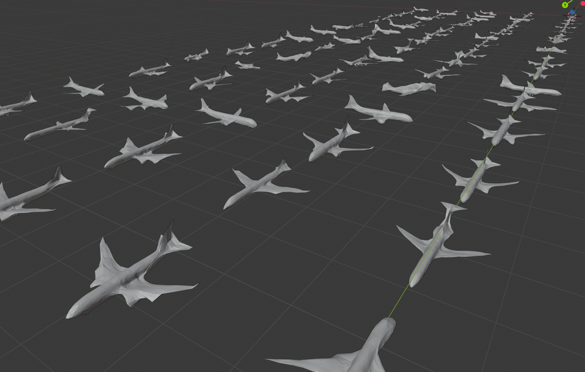

# points2mesh
Deep convolutional neural network transforming 3D point cloud data to a mesh.
Based on [pixel2mesh](https://github.com/nywang16/Pixel2Mesh), which allows to learn the deformation of a mesh represented as a graph, and [flexconvolution](https://github.com/cgtuebingen/Flex-Convolution) to learn features of points in three dimensional space. __points2mesh__ is able to reconstruct from super low resolution of only 256 samples per point cloud, up to 8000 samples.

--------------

__points2mesh__ is trained on a multi-category basis ( 8 categories at the same time ). 
The following shows the input point cloud of 1024 samples of an airplane. Followed by its reconstruction by __points2mesh__ and the underlying ground truth mesh on the right. The reconstruction utilizes about two thousand vertices, while the ground truth has more than 100 thousand vertices.

--------------

The structure of the deep neural network is defined as follows:

--------------

Three more examples of reconstruction with only 256 samples of the point cloud.

A collection of reconstructed airplanes with 1024 samples of the point cloud, without cherrypicking the best results ;)

